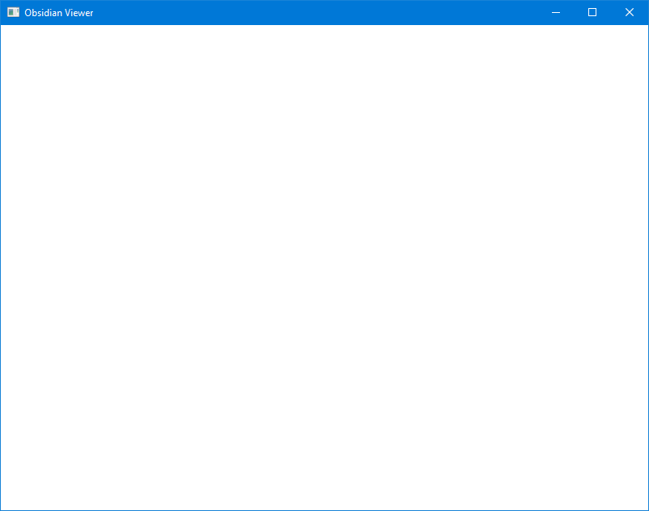

# Introduction

Welcome! This book will guide you through the creation and design of a 3D renderer using the [Rust](https://www.rust-lang.org/) programming language and the [Vulkan](https://www.khronos.org/vulkan/) graphics API.

## Purpose

As of January 2021, the resources for learning Vulkan are scarce. The existing resources largely focus on `C++` and cover various rendering techniques. This is excellent! However, the focus for many of these resources is not on building a structured program that goes beyond the scope of tutorial code. This book is meant to be higher level, demonstrating how to build a 3D world and render it in realtime. This will be particularly of use to indie game developers looking to create a 3D game from scratch without getting overwhelmed.

## Why Rust?

Rust is a great alternative to `C++`!  A few of the benefits:

* It provides a smooth workflow for developers with clear, specific error messages from the compiler
* [rustup](https://rustup.rs/) and [cargo](https://github.com/rust-lang/cargo) make managing rust toolchain installations and rust projects straightforward
* The lints from [clippy](https://github.com/rust-lang/rust-clippy) help to improve the code quality and catch certain common mistakes
* [rustfmt](https://github.com/rust-lang/rustfmt) handles formatting the code and code style
* Memory safety. Code written outside of `unsafe` blocks is checked by the [borrow checker](https://doc.rust-lang.org/book/ch04-02-references-and-borrowing.html?highlight=borrow#references-and-borrowing)

## Target Audience

The target audience of this book is moderately experienced developers with an interest in graphics programming. Prior graphics programming experience, particularly with [OpenGL](https://www.opengl.org) will be particularly useful. Essentially this is the book I would have loved to have available when first starting out with Vulkan.

## What Is Covered

This book is very code-heavy and implementation focused, as opposed to other resources that may be more focused on theory.

## What Is Not Covered

This book will not go into detail on linear algebra concepts or mathematics, as there are already great resources available. This book may not go into as much depth on particular parts of the Vulkan API as other resources might. A list of useful external resources for building upon the content of this book can be found in the `Further Reading` section of the appendix.

## Final Project Preview

### Chapter 1

Set up the project structure, get a window up and running, and create the boilerplate code used throughout the rest of the book. The code in this chapter will serve as the project's foundation.

